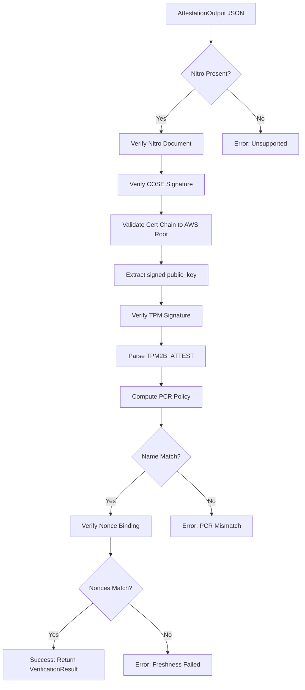

# rawdogtpm2-verify

Verification library for TPM and Nitro attestations produced by `rawdogtpm2`.

## Overview

This crate verifies attestation documents without requiring TPM access. It can run anywhere - on a server, in a browser (via WASM), or in any environment that needs to verify attestations.

## Features

- **Nitro Attestation Verification** - COSE Sign1 signature and certificate chain validation
- **TPM Signature Verification** - ECDSA P-256 signature verification
- **PCR Policy Verification** - Compute and verify PCR policy digests
- **X.509 Chain Validation** - Certificate chain validation using rustls-webpki
- **Zero TPM Dependencies** - Pure cryptographic verification

## Verification Flow



## Usage

```rust
use rawdogtpm2_verify::{verify_attestation_output, AttestationOutput};

fn verify(json: &str) -> Result<(), Box<dyn std::error::Error>> {
    // Parse the attestation output
    let output: AttestationOutput = serde_json::from_str(json)?;

    // Verify the entire attestation
    let result = verify_attestation_output(&output)?;

    println!("Verified via: {:?}", result.method);
    println!("Nonce: {}", result.nonce);
    println!("Root CA hash: {}", result.root_pubkey_hash);

    Ok(())
}
```

## What Gets Verified

### Nitro Path (AWS)

| Check | Description |
|-------|-------------|
| COSE Signature | ECDSA P-384 signature over Nitro document |
| Certificate Chain | Validates to hardcoded AWS Nitro Root CA |
| Public Key Binding | AK public key matches signed `public_key` field |
| TPM Signature | AK's ECDSA P-256 signature over TPM2B_ATTEST |
| PCR Policy | Certified name matches computed policy from SHA-384 PCRs |
| Nonce Binding | TPM nonce matches Nitro nonce (freshness) |
| PCR Values | Claimed PCRs match signed values in Nitro document |

### Verification Result

```rust
pub struct VerificationResult {
    /// The verified nonce (hex-encoded)
    pub nonce: String,
    /// SHA-256 hash of the root CA's public key
    pub root_pubkey_hash: String,
    /// How verification was performed
    pub method: VerificationMethod,
}
```

The `root_pubkey_hash` identifies the trust anchor. For AWS Nitro, this is the hash of the Nitro Root CA's public key.

## API Reference

### Main Functions

```rust
/// Verify a complete AttestationOutput
pub fn verify_attestation_output(
    output: &AttestationOutput
) -> Result<VerificationResult, VerifyError>;

/// Verify just the Nitro document
pub fn verify_nitro_attestation(
    document_hex: &str,
    expected_nonce: Option<&str>,
    expected_pubkey: Option<&str>,
) -> Result<NitroVerifyResult, VerifyError>;

/// Calculate PCR policy digest
pub fn calculate_pcr_policy(
    pcrs: &BTreeMap<u8, String>,
    pcr_alg: TpmAlg,
) -> Result<String, VerifyError>;

/// Compute TPM object name for ECC P-256 key
pub fn compute_ecc_p256_name(
    x: &[u8],
    y: &[u8],
    auth_policy: &[u8],
) -> Vec<u8>;
```

### Error Types

```rust
pub enum VerifyError {
    /// No valid attestation path available
    NoValidAttestation(String),
    /// Signature verification failed
    SignatureInvalid(String),
    /// TPM2B_ATTEST parsing or validation failed
    InvalidAttest(String),
    /// Certificate chain validation failed
    CertificateInvalid(String),
    /// Hex decoding failed
    HexDecode(hex::FromHexError),
}
```

## Security Considerations

### What This Library Trusts

1. **AWS Nitro Root CA** - Hardcoded public key hash. If AWS rotates their root, this library needs updating.

2. **Cryptographic Primitives** - Uses `p256`, `sha2`, `ecdsa` crates for cryptography.

3. **Certificate Validation** - Uses `rustls-webpki` for X.509 chain validation.

### What You Must Verify Separately

1. **PCR Semantics** - This library verifies PCR *values*, not their *meaning*. You need to know what software produces which measurements.

2. **Nonce Freshness** - You must generate and track nonces to prevent replay attacks.

3. **Application Logic** - The attestation proves system state at a point in time. Your application must decide if that state is acceptable.

## Future Support

Currently only the Nitro path is implemented. Future versions may add:

- **GCP Shielded VM** - AK certificate verification via Google CA
- **Azure Trusted Launch** - AK certificate verification via Microsoft CA

These require AK certificates (not just EK certificates) to bind the signing key to the cloud provider's vTPM.
